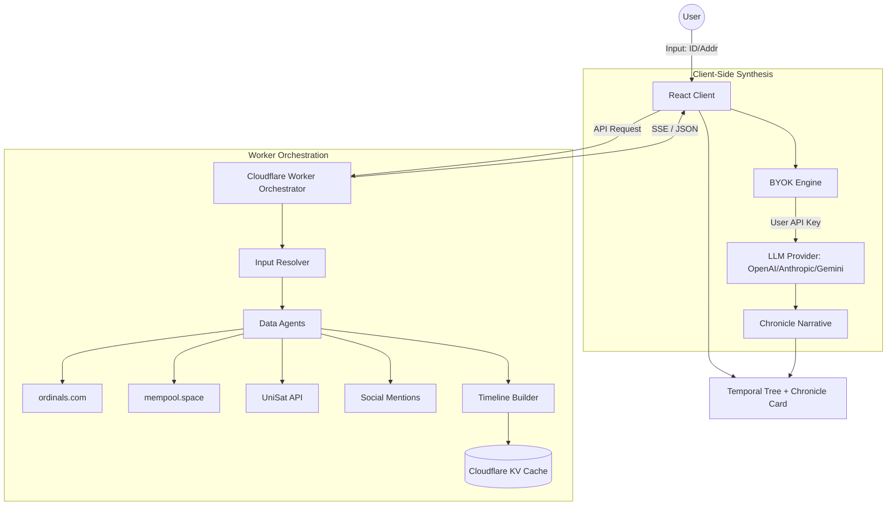

# Architecture: Ordinal Mind

Ordinal Mind is built on a "Factual First, Zero Custody" architecture. It decouples verifiable data collection from subjective AI synthesis.

## System Overview

## Core Design Principles

### 1. Factual Integrity
The system treats on-chain data as the source of truth. Every event in the timeline must have a `source.ref` (TXID, URL, etc.) that allows for independent verification.

### 2. Zero Custody (BYOK)
To protect user privacy and minimize server-side risk, LLM API keys are stored only in the browser's `localStorage` and never sent to the worker. All synthesis requests are initiated directly from the client.

### 3. Graceful Degradation
The product is fully functional without AI. If the BYOK engine is not configured or fails, the user still receives the full factual temporal tree and metadata.

### 4. Deterministic Orchestration
Given the same upstream data, the `Timeline Builder` produces identical results. This ensures that the chronicle is a stable record of history.

## Data Pipeline

1.  **Resolution**: The `Resolver` converts inscription numbers or Taproot addresses into a canonical Inscription ID.
2.  **Parallel Extraction**: Data agents fetch information concurrently from specialized providers (Mempool for transfers, UniSat for rarity, etc.).
3.  **SSE Streaming**: For fresh scans, the worker streams progress updates to the client using Server-Sent Events (SSE), providing immediate feedback.
4.  **Verification & Validation**: The `Validation` module cross-references data from different indexers to detect inconsistencies.
5.  **Merge & Sort**: The `Timeline Engine` performs a chronological sort and deduplication of all discovered events.
6.  **Caching**: Completed chronicles are cached in Cloudflare KV with appropriate TTLs (long for immutable genesis data, short for volatile market data).

## Caching Strategy

- **Immutable Data**: Genesis metadata and historical blocks are cached with long TTLs.
- **Volatile Data**: Sales heuristics and marketplace activity use shorter TTLs to ensure freshness.
- **Cache Keys**: Deterministic keys based on normalized Inscription IDs.
- **Bypass**: The `?stream=1` or `?debug=1` flags bypass the cache to perform a fresh scan.

## Security Model

- **No Server-Side Secrets**: No API keys for LLMs are stored on the server.
- **Public Data Only**: The application only aggregates data that is publicly accessible on the Bitcoin blockchain or web.
- **Input Sanitization**: Strict regex validation for all user inputs.
