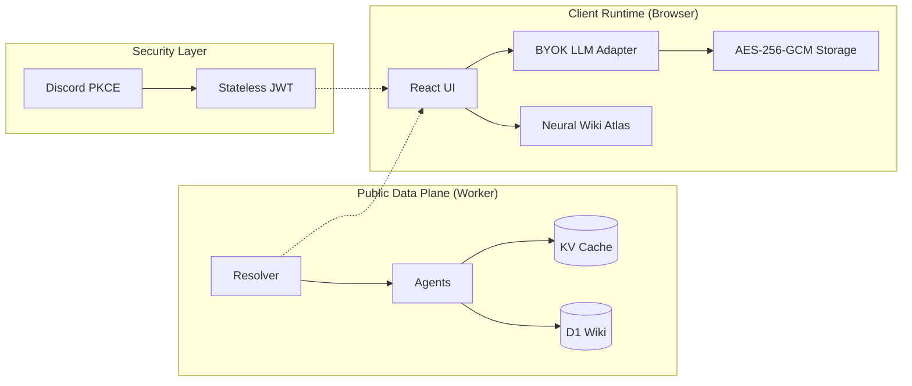

<div align="center">

# OrdinalMind

[](https://www.typescriptlang.org/)
[](https://react.dev/)
[](https://workers.cloudflare.com/)
[](https://opensource.org/licenses/Apache-2.0)

</div>

**OrdinalMind** is a high-performance factual resolution engine for Bitcoin Ordinals. It architectures a verifiable temporal tree of assets by orchestrating multi-source on-chain data with client-side AI synthesis.

---

## 🏗️ System Architecture

OrdinalMind operates on a **Stateless Data Plane** coupled with a **Client-Side Synthesis Layer**, ensuring that sensitive credentials (LLM keys) never touch the server runtime.



---

## 🛠️ Technical Stack

| Category | Technology |
| :--- | :--- |
| **Compute** | Cloudflare Workers (Edge Runtime) |
| **Storage** | Cloudflare D1 (SQL), Cloudflare KV (Cache) |
| **Frontend** | React 19, Motion 12, Cytoscape.js (Neural Graph) |
| **Identity** | Discord OAuth2 (PKCE), HMAC-SHA256 JWT |
| **MCP** | MCP TypeScript SDK v1, Cloudflare `createMcpHandler`, OAuth 2.1 |
| **AI/LLM** | Client-side BYOK (OpenAI, Anthropic, Gemini) |
| **Moderation** | Cloudflare Workers AI (Llama Guard 3) |
| **Tooling** | Vite 6, Vitest, Wrangler |

---

## ⛓️ Resolution Pipeline (L0-L3)

OrdinalMind resolves assets through a tiered verification pipeline:

| Layer | Type | Description |
| :--- | :--- | :--- |
| **Layer 0** | **Factual** | Atomic event resolution from `ordinals.com`, `mempool.space`, and `UniSat`. |
| **Layer 1** | **Consensus** | Human-contributed knowledge via the Wiki Engine, weighted by Discord Collector Tiers. |
| **🛡️ Safety** | **Fiscal Agent** | Real-time automated moderation of contributions using **Llama Guard 3**. |
| **Layer 2** | **Narrative** | Deterministic prompt construction for client-side LLM synthesis. |
| **🌱 Seed** | **Wiki Seed Agent** | Proactive extraction of structured wiki fields from initial narratives. |
| **Layer 3** | **Discovery** | Heuristic web signal discovery and X (Twitter) mention scraping. |

---

## 🚀 Key Features

| Feature | Description |
| :--- | :--- |
| **Multi-Source** | Deterministic merging of disparate indexer data into a single chronology. |
| **Wiki Atlas** | Force-directed neural graph visualization (`cytoscape-fcose`) of asset relationships. |
| **Intent Chat** | Client-side chat loop with integrated research tools and `<wiki_contribution>` extraction. |
| **Sealed Security** | LLM keys are encrypted at-rest using **AES-256-GCM** (client-side only). |
| **SSE Progress** | Real-time resolution status and research activity monitoring via Server-Sent Events. |
| **Proactive Wiki** | Background extraction of structured knowledge from narratives to seed the wiki immediately. |
| **Fiscal Agent** | Automated edge-based content moderation that allows community slang while blocking harmful content. |

---

## Quick Start

### Development Environment
```bash
# 1. Install dependencies
npm install

# 2. Initialize local D1 database
npm run db:migrate:local

# 3. Start the edge-runtime dev server
npm run dev
```

### Quality Assurance
```bash
# Execution of the 40+ unit and integration tests
npm run test

# Static type analysis
npm run typecheck
```

---

## API Interface

| Endpoint | Method | Scope | Description |
| :--- | :--- | :--- | :--- |
| `/api/chronicle` | `GET` | Public | SSE stream of inscription metadata and events. |
| `/api/wiki/collection/:slug/consolidated` | `GET` | Public | Merged L0/L1 consensus-driven data. |
| `/api/wiki/collection/:slug/graph` | `GET` | Public | Neural graph nodes and edges. |
| `/api/wiki/contribute` | `POST` | Auth | Submit structured knowledge updates. |
| `/api/auth/discord` | `GET` | Public | Initiate Discord PKCE handshake. |

## MCP Interface

| Endpoint | Method | Scope | Description |
| :--- | :--- | :--- | :--- |
| `/mcp` | `GET`, `POST`, `DELETE`, `OPTIONS` | Public/Auth | MCP Streamable HTTP endpoint (feature-flagged, per-request server instance). |
| `/mcp/oauth/authorize` | `GET` | Public | Starts MCP OAuth 2.1 authorization flow via Discord identity. |
| `/mcp/oauth/callback` | `GET` | Public | OAuth callback endpoint for the MCP flow. |
| `/mcp/oauth/token` | `POST` | Public | MCP OAuth token endpoint (provider-managed). |
| `/mcp/oauth/register` | `POST` | Public | MCP OAuth dynamic client registration endpoint (provider-managed). |
| `/mcp/oauth/flow/start` | `POST` | Public | Starts agent-friendly MCP OAuth flow session (returns flow metadata + authorization URLs). |
| `/mcp/oauth/flow/authorize` | `GET` | Public | Short authorization redirect endpoint (`flow_id` -> Discord authorize URL). |
| `/mcp/oauth/flow/status` | `GET` | Public | Returns flow state (`pending` -> `token_ready`) and short-lived token exchange payload when ready. |
| `/mcp/oauth/flow/complete` | `POST` | Public | Optional flow finalization endpoint. |
| `/mcp/oauth/flow/cancel` | `POST` | Public | Cancels abandoned flow sessions. |
| `/.well-known/oauth-protected-resource` | `GET` | Public | Protected resource metadata for MCP clients. |

### MCP Resources

| URI Scheme | Description |
| :--- | :--- |
| `chronicle://inscription/{id}` | Factual chronicle from KV-first pipeline with guardrails. |
| `wiki://page/{slug}` | Public wiki page payload for collection/inscription/artist/sat slugs. |
| `wiki://collection/{slug}` | Tier-weighted wiki consolidated snapshot. |
| `collection://context/{slug}` | Collection context + graph summary (+ inscription context if applicable). |

### MCP Tools and Capability Gates

| Tool | Access Tier | Description |
| :--- | :--- | :--- |
| `help` | Public | Read-only usage and strategy guide for agents. |
| `query_chronicle` | Public | Public read-only query tool. |
| `search_collection_inscriptions` | Public | Public read-only query tool. |
| `wiki_search_pages` | Public | Wiki search across all page entity types with shape hints. |
| `wiki_list_pages` | Public | Paginated inventory of wiki pages. |
| `wiki_get_page` | Public | Exact wiki page fetch by slug with explicit `publication_status`. |
| `wiki_stats` | Public | Global wiki counters and governance metrics. |
| `wiki_list_fields` | Public | Canonical field discovery for write preflight. |
| `wiki_get_field_status` | Public | Wiki coverage and status tool. |
| `wiki_get_collection_context` | Public | Wiki context snapshot tool. |
| `wiki_propose_update` | `Community`+ | Moderated proposal tool following app tier rules. |
| `contribute_wiki` | `Community`+ | Submit knowledge updates (`Genesis`, `OG`, `Community`). |
| `review_contribution` | `Genesis` | Review and approve/reject contributions. |
| `refresh_chronicle` | `Genesis` | Force refresh with progress tracking. |
| `reindex_collection` | `Genesis` | Trigger reindexing with progress tracking. |

> [!NOTE]
> Anonymous MCP access exposes resources and read-only query tools only.

### MCP Runtime Flags

| Flag | Value | Description |
| :--- | :--- | :--- |
| `MCP_ENABLED` | `1` | Enables `/mcp` routing. |
| `MCP_OAUTH_ENABLED` | `1` | Enables dedicated MCP OAuth endpoints and token validation. |
| `MCP_SPEC_TARGET` | `2025-11-25` | Project compliance target marker for MCP behavior. |

### KV Best Practice for OAuth

> [!IMPORTANT]
> `OAUTH_KV` should use a dedicated KV namespace (not shared with `CHRONICLES_KV`) to isolate OAuth transient state and token records from factual chronicle cache data.

---

## Technical Documentation

- [**ARCHITECTURE.md**](./docs/ARCHITECTURE.md): Deep dive into data flow and consensus.
- [**CODEBASE.md**](./docs/CODEBASE.md): Responsibility map and directory structure.
- [**mcp-usage.md**](./docs/mcp-usage.md): Practical MCP usage (`initialize`, `resources/read`, OAuth, troubleshooting).
- [**AGENTS.md**](./AGENTS.md): Product thesis and implementation constraints.

---

## Trademark & Brand

**OrdinalMind™** and the OrdinalMind identity are associated with the official project and public deployment maintained by the original creators.

This repository is open-source under the **Apache 2.0 License**.  
You are free to use, modify and distribute the code in accordance with the license terms.

However, use of the "OrdinalMind" name, branding, visual identity and associated public infrastructure in ways that may cause confusion or imply official endorsement is discouraged without explicit permission.

---

## Support OrdinalMind

OrdinalMind is open-source and community-driven.

If this project helped you preserve or explore Bitcoin history, consider supporting its development.

BTC address:
```
3DDvVXKEeXp4q5og3JQ8ytnhQ3cty2eHiV
```

---

<p align="center">
  <i>Ordinals are forever and your history is being written. Help us write it.</i>
</p>
