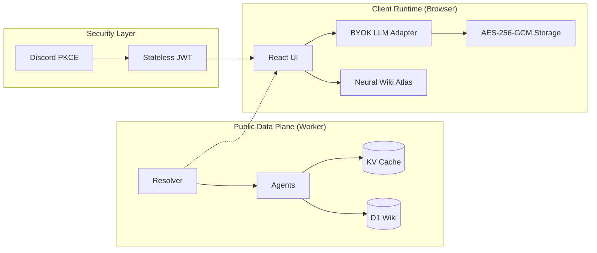

# Ordinal Mind

[](https://www.typescriptlang.org/)
[](https://react.dev/)
[](https://workers.cloudflare.com/)
[](https://opensource.org/licenses/MIT)

**Ordinal Mind** is a high-performance factual resolution engine for Bitcoin Ordinals. It architectures a verifiable temporal tree of assets by orchestrating multi-source on-chain data with client-side AI synthesis.

---

## 🏗️ System Architecture

Ordinal Mind operates on a **Stateless Data Plane** coupled with a **Client-Side Synthesis Layer**, ensuring that sensitive credentials (LLM keys) never touch the server runtime.



---

## 🛠️ Technical Stack

| Category | Technology |
| :--- | :--- |
| **Compute** | Cloudflare Workers (Edge Runtime) |
| **Storage** | Cloudflare D1 (SQL), Cloudflare KV (Cache) |
| **Frontend** | React 19, Motion 12, Cytoscape.js (Neural Graph) |
| **Identity** | Discord OAuth2 (PKCE), HMAC-SHA256 JWT |
| **AI/LLM** | Client-side BYOK (OpenAI, Anthropic, Gemini) |
| **Tooling** | Vite 6, Vitest, Wrangler |

---

## ⛓️ Resolution Pipeline (L0-L3)

Ordinal Mind resolves assets through a tiered verification pipeline:

- **Layer 0 (Factual)**: Atomic event resolution from `ordinals.com`, `mempool.space`, and `UniSat`.
- **Layer 1 (Consensus)**: Human-contributed knowledge via the **Wiki Engine**, weighted by Discord Collector Tiers (`Genesis` > `OG` > `Community`).
- **Layer 2 (Narrative)**: Deterministic prompt construction for client-side LLM synthesis.
- **Layer 3 (Discovery)**: Heuristic web signal discovery and X (Twitter) mention scraping.

---

## 🚀 Key Features

- **🌐 Multi-Source Orchestration**: Deterministic merging of disparate indexer data into a single chronology.
- **🧠 Wiki Atlas**: Force-directed neural graph visualization (`cytoscape-fcose`) of asset relationships.
- **💬 Intent-Aware Chat**: Client-side chat loop with integrated research tools and `<wiki_contribution>` extraction.
- **🛡️ Sealed Security**: LLM keys are encrypted at-rest in `localStorage` using **AES-256-GCM** derived from the user's JWT.
- **⚡ SSE-Powered Progress**: Real-time resolution status and research activity monitoring via Server-Sent Events.

---

## 🏁 Quick Start

### Development Environment
```bash
# 1. Install dependencies
npm install

# 2. Initialize local D1 database
npm run db:migrate:local

# 3. Start the edge-runtime dev server
npm run dev
```

### Quality Assurance
```bash
# Execution of the 40+ unit and integration tests
npm run test

# Static type analysis
npm run typecheck
```

---

## 📡 API Interface

| Endpoint | Method | Scope | Description |
| :--- | :--- | :--- | :--- |
| `/api/chronicle` | `GET` | Public | SSE stream of inscription metadata and events. |
| `/api/wiki/collection/:slug/consolidated` | `GET` | Public | Merged L0/L1 consensus-driven data. |
| `/api/wiki/collection/:slug/graph` | `GET` | Public | Neural graph nodes and edges. |
| `/api/wiki/contribute` | `POST` | Auth | Submit structured knowledge updates. |
| `/api/auth/discord` | `GET` | Public | Initiate Discord PKCE handshake. |

---

## 📖 Technical Documentation

- 🗺️ [**ARCHITECTURE.md**](./docs/ARCHITECTURE.md): Deep dive into data flow and consensus.
- 🗺️ [**CODEBASE.md**](./docs/CODEBASE.md): Responsibility map and directory structure.
- 🤖 [**AGENTS.md**](./AGENTS.md): Product thesis and implementation constraints.
- 🗺️ [**ROADMAP.md**](./ROADMAP.md): Sprint history and future milestones.

---

<p align="center">
  <i>Engineered for truth, auditability, and decentralization.</i>
</p>
